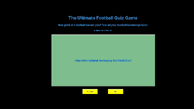

# Web Development Project 2 - *Flashcards*

Submitted by: **Rudy Orahin**

This web app is a dynamic Flashcard application designed to help users learn and memorize information through a series of interactive cards. Each card presents a question or a statement on one side and reveals the answer or corresponding information on the flip side. The app enhances learning experiences by introducing randomness and allowing the incorporation of visual elements into the learning material.

Time spent: **8** hours spent in total

## Required Features

The following **required** functionality is completed:

- [x] **The title of the card set and some information about it, such as a short description and the total number of cards are displayed**
- [x] **A single card at a time is displayed, only showing one of the components of the information pair**
- [x] **A list of card pairs is created**
- [x] **Clicking on the card shows the corresponding component of the information pair**
- [x] **Clicking the next button displays a random new card**

The following **optional** features are implemented:

- [x] Cards contain images in addition to or in place of text
- [x] Cards have different visual styles such as color based on their category
  - [x] *Visual style implemented based on difficulty levels such as easy, medium, and hard.*

The following **additional** features are implemented:

* [x] Adaptive layout for mobile and desktop viewing to enhance usability across devices.
* [x] Categories and difficulty levels for cards to aid structured learning and progression.
* [x] Progress tracking to provide feedback to the user on their advancement through the card set.

## Video Walkthrough

Here's a walkthrough of implemented required features:

## Notes

During the development of the Flashcard app, challenges were encountered mainly in implementing the random card functionality to ensure no repetition occurs before all cards have been displayed. Additionally, designing a user-friendly interface that accommodates both text and image content without clutter was a meticulous task that required careful consideration of layout and styling.

## License

    Copyright [2024] [Rudy Orahin]

    Licensed under the Apache License, Version 2.0 (the "License");
    you may not use this file except in compliance with the License.
    You may obtain a copy of the License at

        http://www.apache.org/licenses/LICENSE-2.0

    Unless required by applicable law or agreed to in writing, software
    distributed under the License is distributed on an "AS IS" BASIS,
    WITHOUT WARRANTIES OR CONDITIONS OF ANY KIND, either express or implied.
    See the License for the specific language governing permissions and
    limitations under the License.
